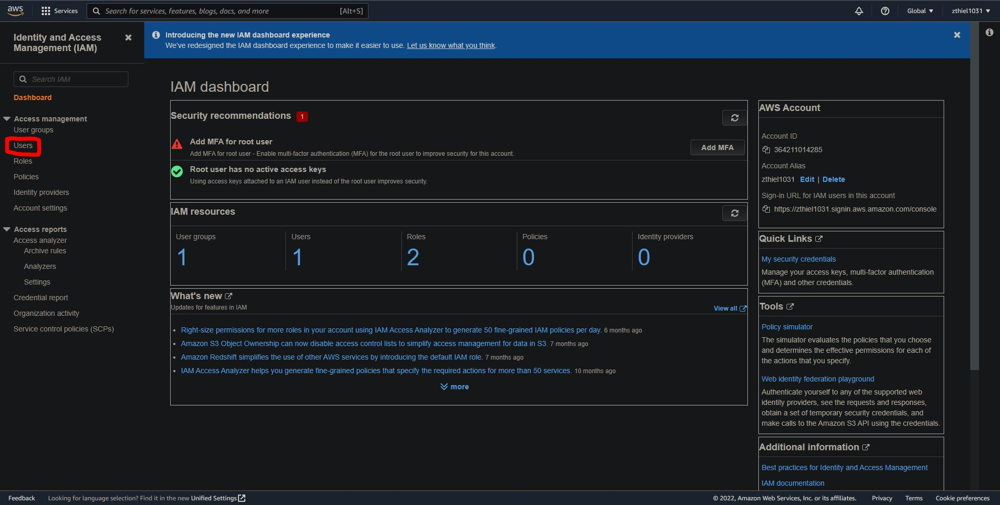

IAM = Identity Access Management, is a global service.

`Root` account is created by default however it shouldn't be used or shared

`Users` are individuals within your organization and can be grouped. They don't have to belong to a group or can belong to many groups if applicable

`Groups` can only contain users, not other groups

`Policies` are JSON documents that define the permissions for a user or group.

In `AWS` we will use the ***Least privilege principle*** meaning we will not give more permissions than a user needs.

We will now create an `admin` account. Our `admin` account will have almost the same permissions as the `root` account.

From our main `root` dashboard, we can search `IAM` and click on `IAM` under services.

Click on `Users`

Then `Add users`

Enter a user name and for credential type we will choose `Password`.

For now, set a custom password and turn off the feature that requires you to create a new password on the next login.

Click the `next` button to move onto permissions

After creating the user they must be added to a group. Following best practices requires us to move away from the root user. Let's do that now.

Click ` Create Group`

Name the group `admin`

Any user placed within group admin will inherit the permissions that are defined for the group. 
Permissions are defined through policies and the policy that will be attached to the admin group is called `AdministratorAccess`

Click `Next` to move onto tags.

Tags are key value pairs and are used to organize, track, or control access for the user. For now we can set the tag for the user `Ben`. The `Key` being Department and the `Value` we set to Engineering

Clicking next takes you to a review screen where you will see the run down of all the information that was just entered to create the `IAM` user/group/tags.

On the next page ther is a `Download .csv` option which will download an excel document with all the credentials if you had chosen to auto generate a password that information would be in there. You can also email the login instructions from this page.

