# Emailing using AWS Lambda for S3 bucket uploads

This will serve as a walkthrough for using AWS Lambda in conjunction with SES to email an employee everytime a file is uploaded to a specific S3 bucket. 

As you progress through the walkthrough please note that any <span style="color:red">red highlighted text</span> will be the clickable options in the management console and any <span style="color:yellow">yellow highlighted text</span> will be the fill in variables.


## Steps to deploying lambda function

- set IAM policy and execution role
- verify email identity
- create lambda function for sending email through SES 
- create S3 bucket
- add trigger


# IAM policy and Execution role

In order to access and use the SES service we must first create a <span style="color:red">Role</span> and a <span style="color:red">Policy</span>.

To create a `policy` follow these steps:


1. Navigate to <span style="color:red">IAM</span> in the management console.

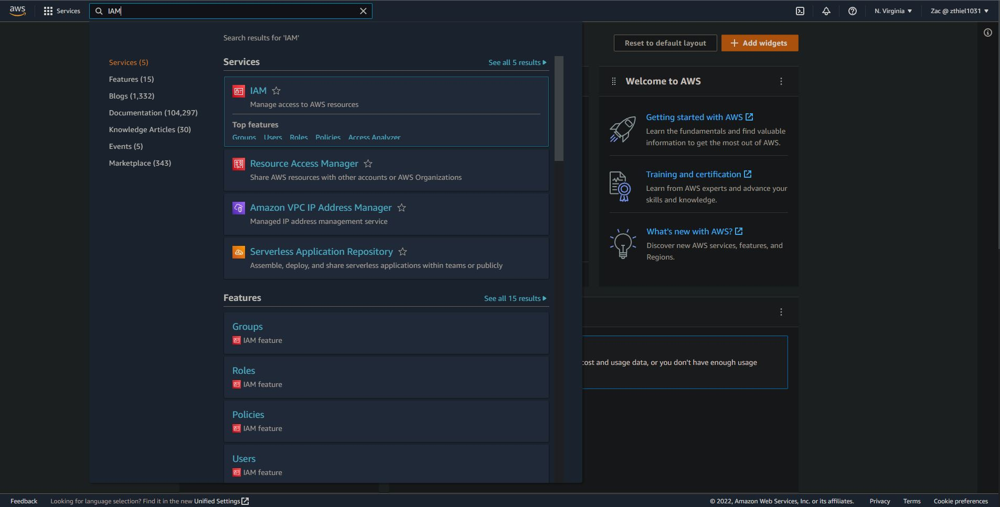

2. On the left-hand side, click <span style="color:red">Policies</span> then <span style="color:red">Create policy</span>

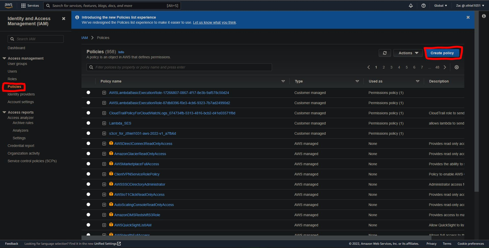

3. After clicking on create policy, select the <span style="color:red">JSON</span> tab. Delete everything in the box and enter this code:

```json
{
    "Version": "2012-10-17",
    "Statement": [
        {
            "Effect": "Allow",
            "Action": [
                "ses:SendEmail",
                "ses:SendRawEmail"
            ],
            "Resource": "*"
        }
    ]
}
```

4. Next click on <span style="color:red">Tags</span>
    You can elect to continue without tagging however, it is not recommended, as tags help keep things organized.

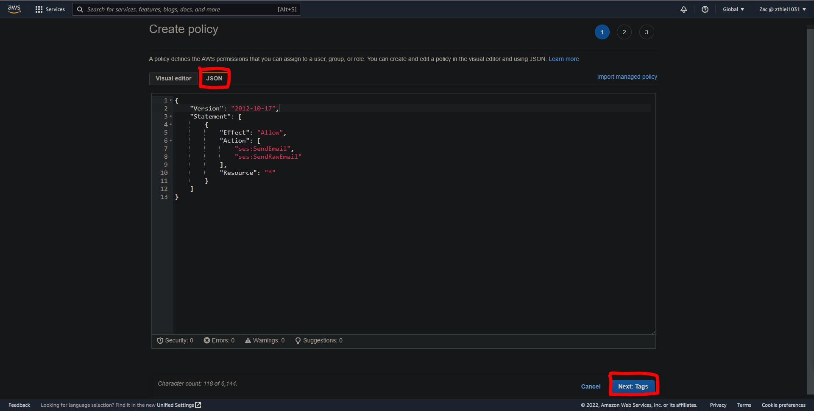

5. After applying the appropriate tags for the `Key` we will use <span style="color:yellow">email_project</span> and the `Value` we will use <span style="color:yellow">ses_lambda_allow</span>.

6. Click on <span style="color:red">Review</span> to continue to the final step in the policy creation.

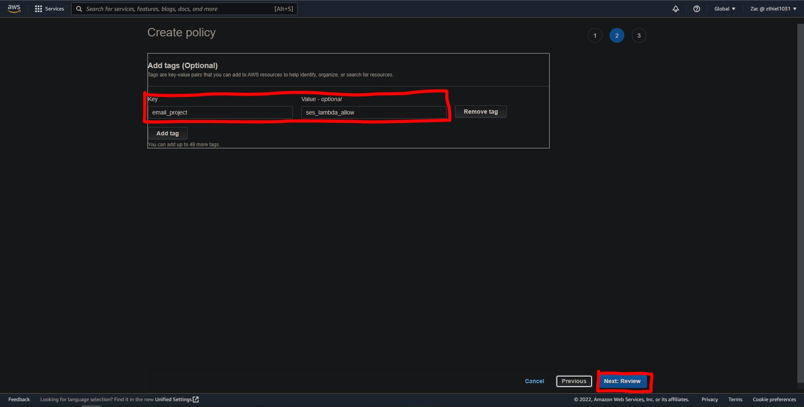

7. Finally we can give our `policy` a `name` in this case we will use <span style="color:yellow">Lambda_SES</span> and a meaningful `description` then click on <span style="color:red">Create policy</span>.

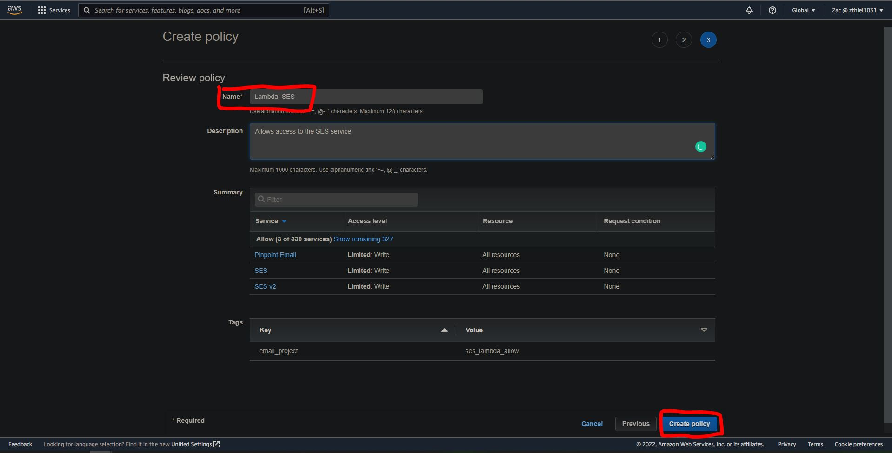

---

Next we will create a `Role` to give `Lambda` permission to access the `SES` service through our `policy`.

To create a `Role` follow these steps:

1. Navigate to <span style="color:red">IAM</span> in the management console.


2. On the left-hand side, click <span style="color:red">Roles</span> then <span style="color:red">Create role</span>

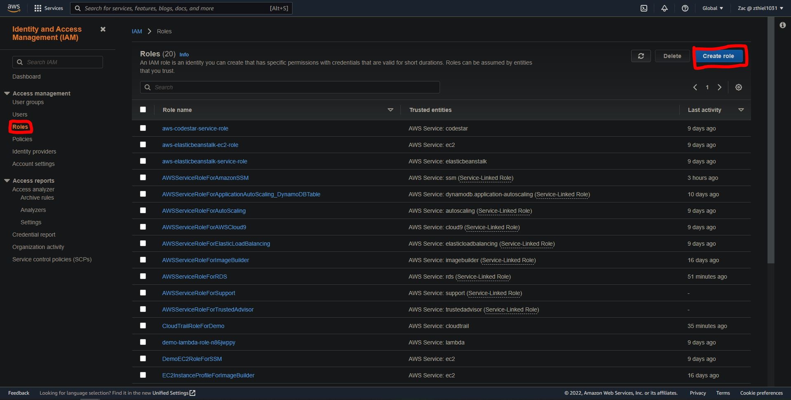

3. Since we are using `Lambda` with `SES` we can set `Trusted entity type` as <span style="color:yellow">AWS service</span> if not already selected. We can set our use case as <span style="color:yellow">Lamda</span> and click <span style="color:red">Next</span>

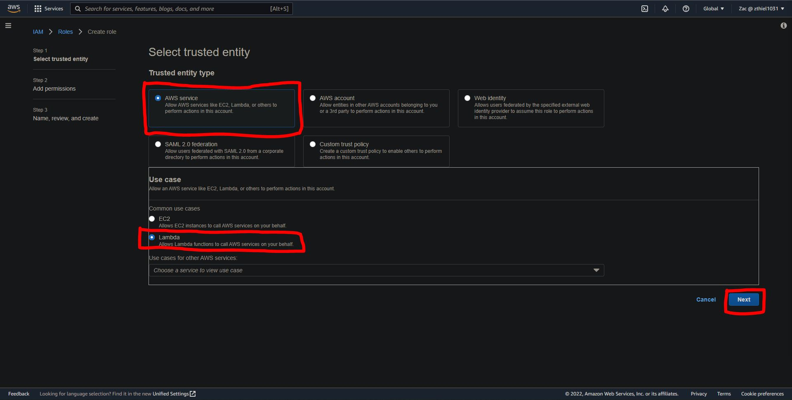

4. Next select our policy that was created in the `Policy` section. Under `Permissions policies` select our <span style="color:yellow">Lamda_SES</span> policy and click <span style="color:red">Next</span>.

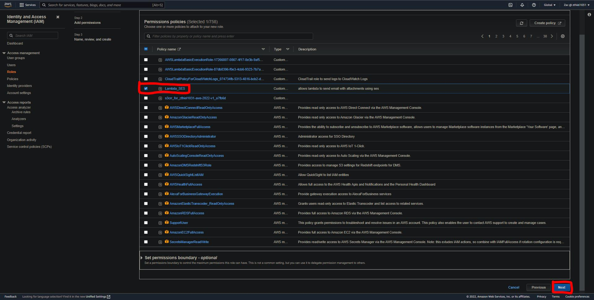

5. Now give a name to `Role`. In this exmaple the name <span style="color:yellow">lambda_allow_ses</span> will be used. Then fill in tags `Key` is <span style="color:yellow">email_project</span> and `Value` is <span style="color:yellow">lambda_iam</span>. Click <span style="color:red">Create role</span> after finishing.

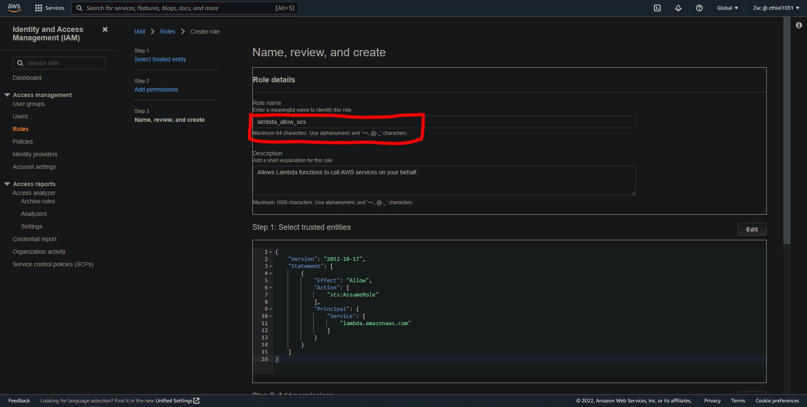

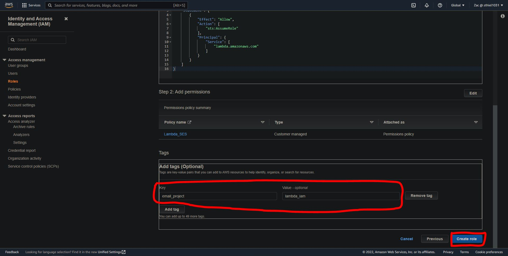


# Verify Email Identity

In order to use the `SES` service, the email sender and recipient address identities must be created and verified.

To do so follow these steps:

1. Navigate to <span style="color:red">Amazon Simple Email Service</span> in the management console.

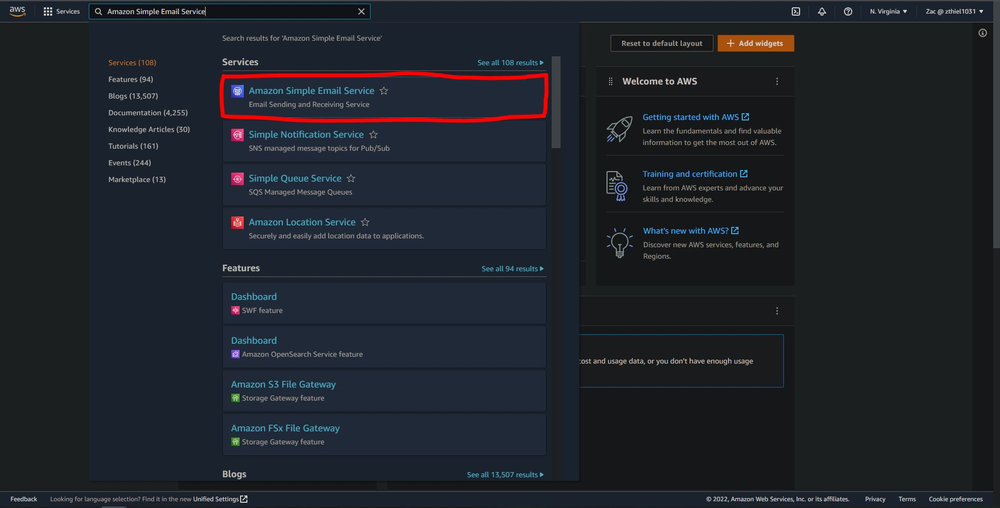

2. In the left-hand pane click <span style="color:red">Verified Identities</span> then click <span style="color:red">Create identity</span>

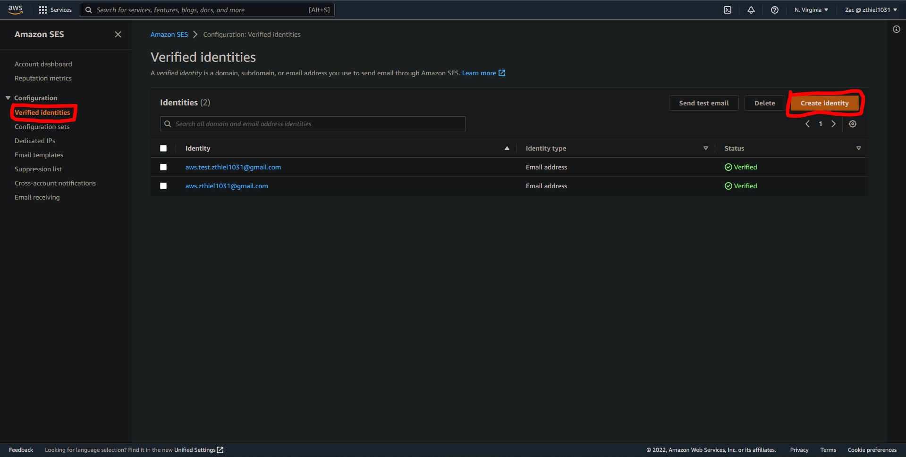

3. For `Identity type` select <span style="color:yellow">Email address</span>. In the box below, enter the email address to send or recieve the email, <span style="color:yellow">aws.zthiel1031@gmail.com</span> will be used for this example.

4. Tags again are optional, but for consistency and organization sake, tag the `Key` as <span style="color:yellow">email_project</span> and the `Value` as <span style="color:yellow">email-1</span>. Then click <span style="color:red">Create identity</span>.

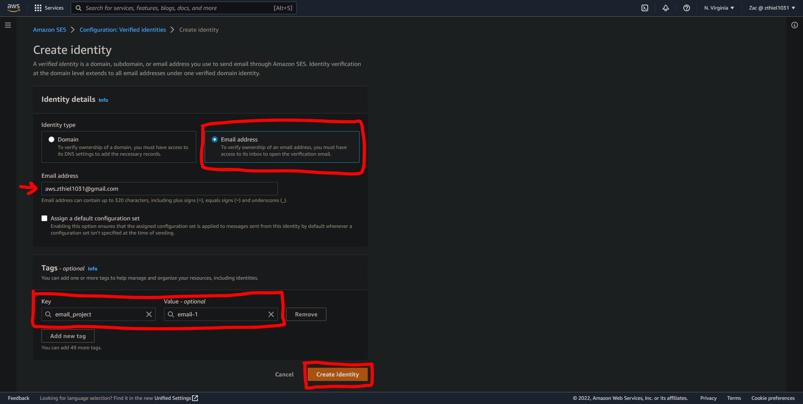

## Repeat steps 2-4 for a second identity
### In our case <span style="color:yellow">aws.test.zthiel1031@gmail</span> was used as the second identity. 

5. After creating the `Identities` navigate to your email inbox and look for an email from `Amazon Web Services` inside click on the <span style="color:red">hyperlink</span> to authorize this email to be used with `SES`

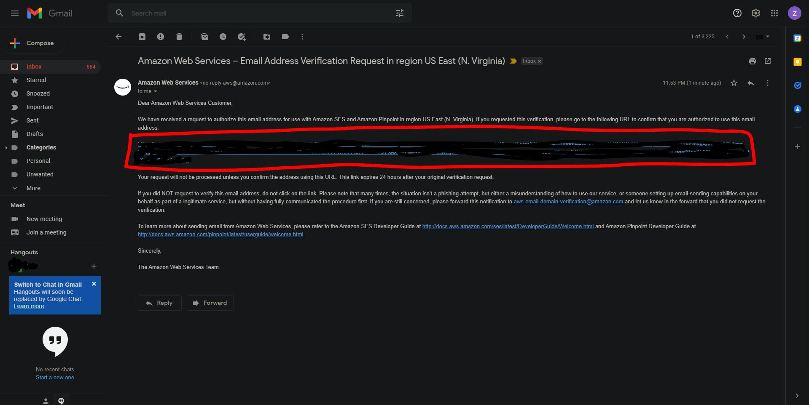

After doing this screen will be shown to confirm email authorization.

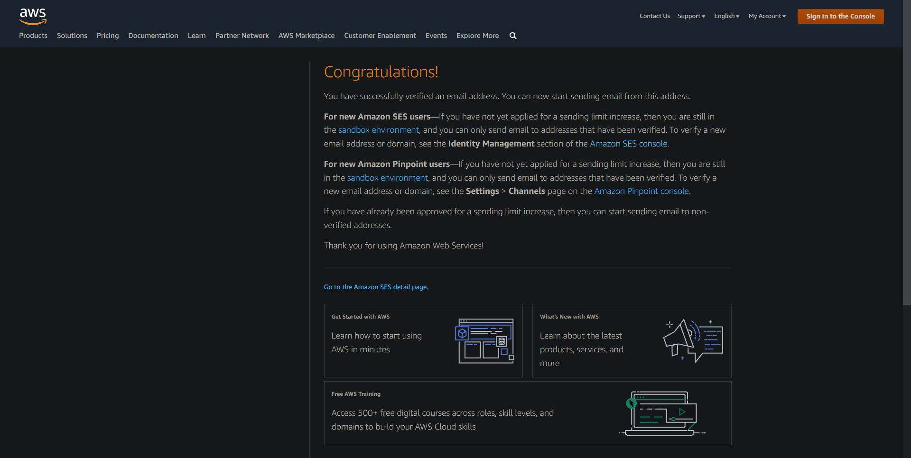


# Create Lambda function and test

Now lets move on to create our `Lambda` function.

To do so follow these steps:

1. Navigate to <span style="color:red">Lambda</span> in the management console.

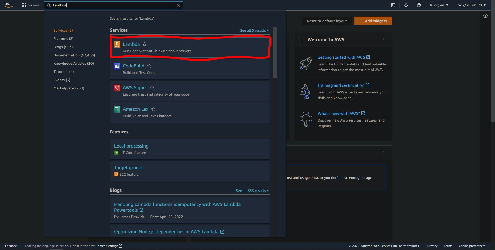

2. On the left-hand pane click on <span style="color:red">Functions</span> then click <span style="color:red">Create function</span>.

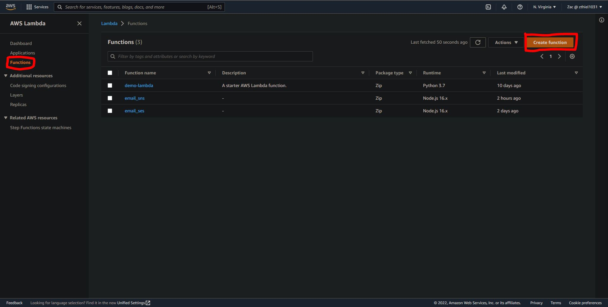

3. Select <span style="color:yellow">Author from scratch</span>, then enter a function name. <span style="color:yellow">email_ses</span> will be used in this example. Leave `Runtime` as <span style="color:yellow">Node.js 16.x</span> and select <span style="color:yellow">x86_64</span> for `Architecture`.
Under `Advanced settings` check the box <span style="color:red">Enable Tags</span> and create tags for this function. <span style="color:yellow">email_project</span> will be the `Key` and <span style="color:yellow">send_ses_lambda</span> will be the `Value`. After all that is done click <span style="color:red">Create function</span>.

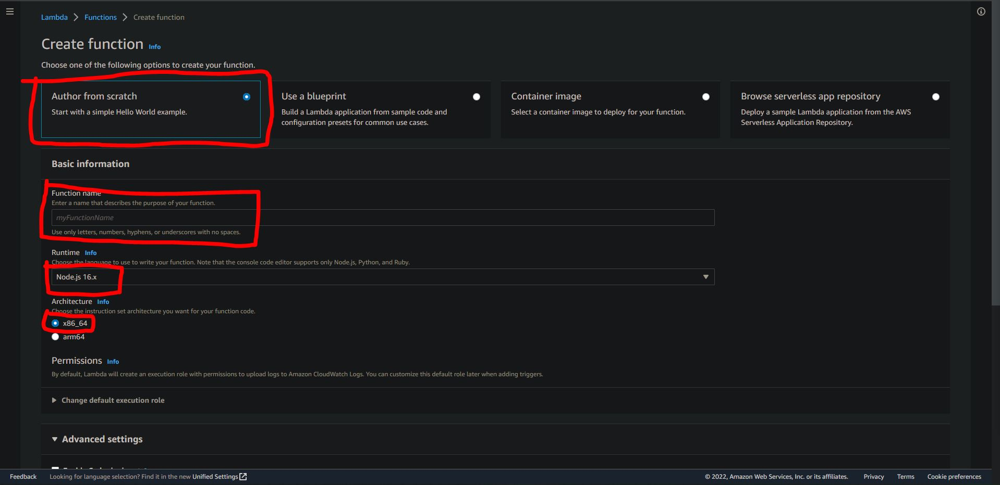

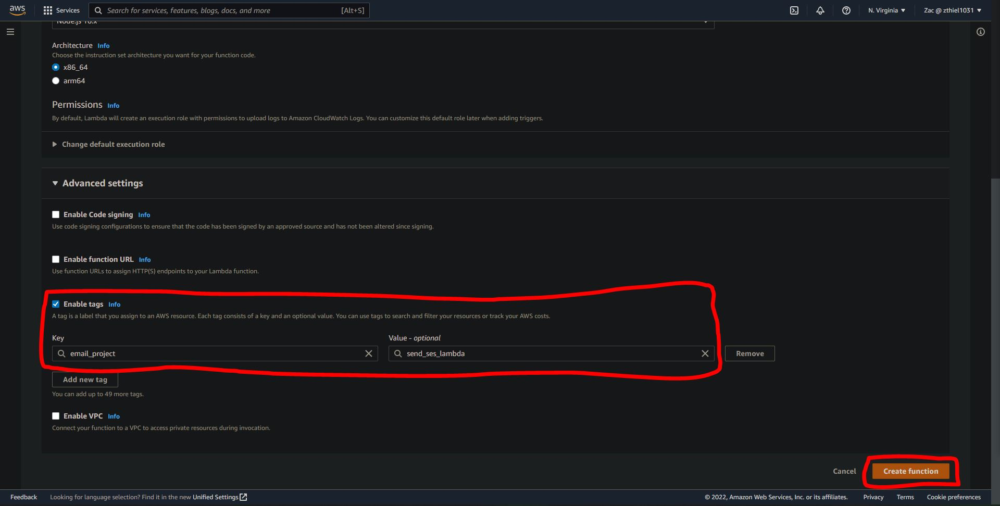

4. On the left-hand pane click on <span style="color:red">Functions</span> then click the newly created function <span style="color:red">email_ses</span>.

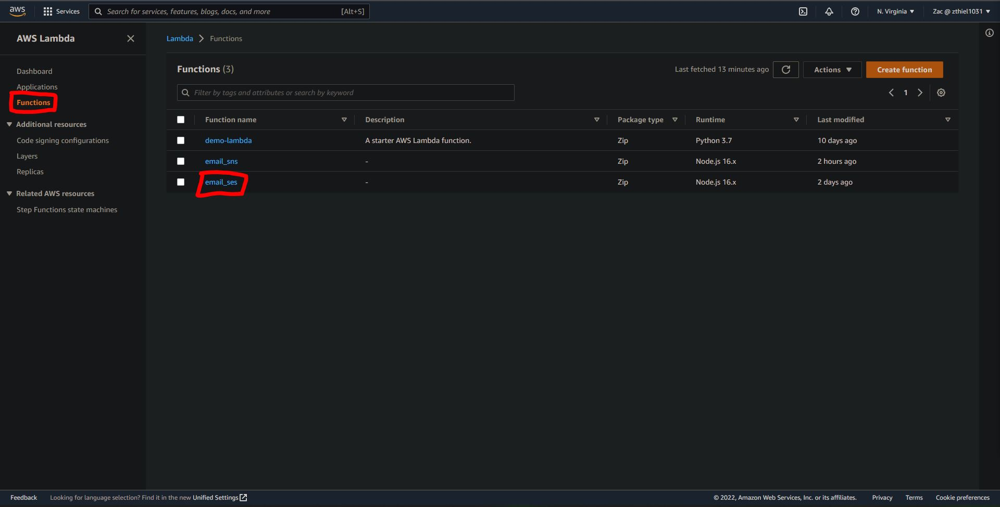

5. Scroll down and click on <span style="color:red">Configuration</span> then, <span style="color:red">Permissions</span>. Make sure the `Role name` matches the role we created above. If it does not, click on <span style="color:red">Edit</span> and under `Existsing role` at the bottom, select the role from the drop-down.

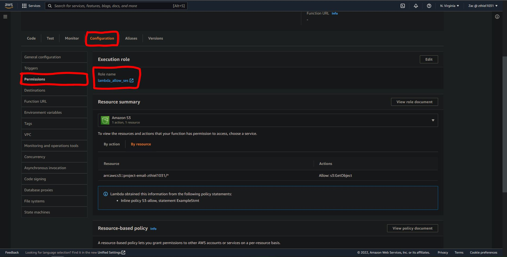


6. Click on <span style="color:red">Code</span>. Replace the pre-existing code with this:

```json
// Copyright 2019 Amazon.com, Inc. or its affiliates. All Rights Reserved.
// SPDX-License-Identifier: Apache-2.0

var aws = require("aws-sdk");
var ses = new aws.SES({ region: "us-east-1" });
exports.handler = async function (event) {
  var params = {
    Destination: {
      ToAddresses: ["aws.test.zthiel1031@gmail.com"],
    },
    Message: {
      Body: {
        Text: { Data: "A new file has been added to the project-email-zthiel1031 bucket." },
      },

      Subject: { Data: "New File Upload" },
    },
    Source: "aws.zthiel1031@gmail.com",
  };
 
  return ses.sendEmail(params).promise()
};

```

# Please note!
### the `ToAddresses` and `Source` need to be changed to one of your verified identities.

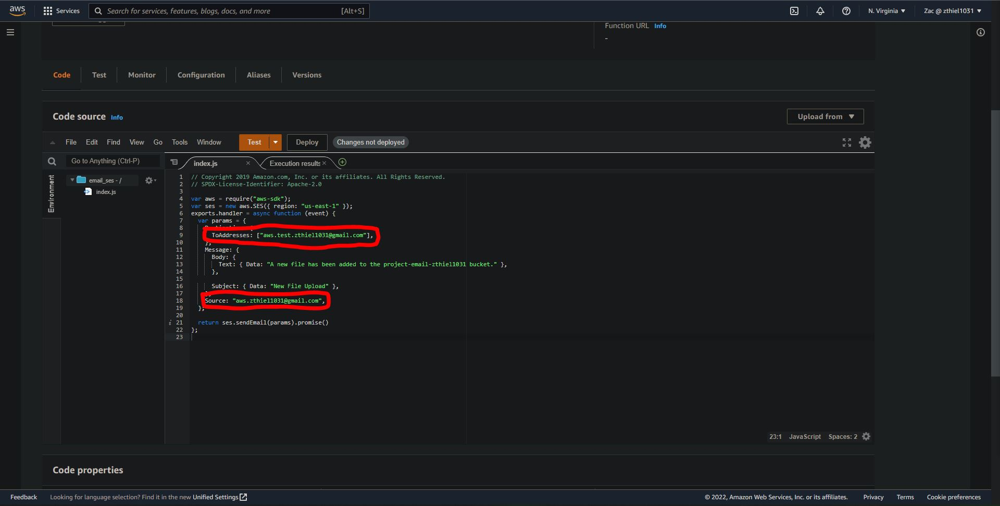

7. After the code is entered click <span style="color:red">Deploy</span>, then <span style="color:red">Test</span>. A `Configure test event` window will pop up. Set `Test event action` to <span style="color:yellow">Create new event</span> and give the event a name. <span style="color:yellow">TestEvent</span> will be used for the example. Leave everything as it is and click <span style="color:red">Save</span>

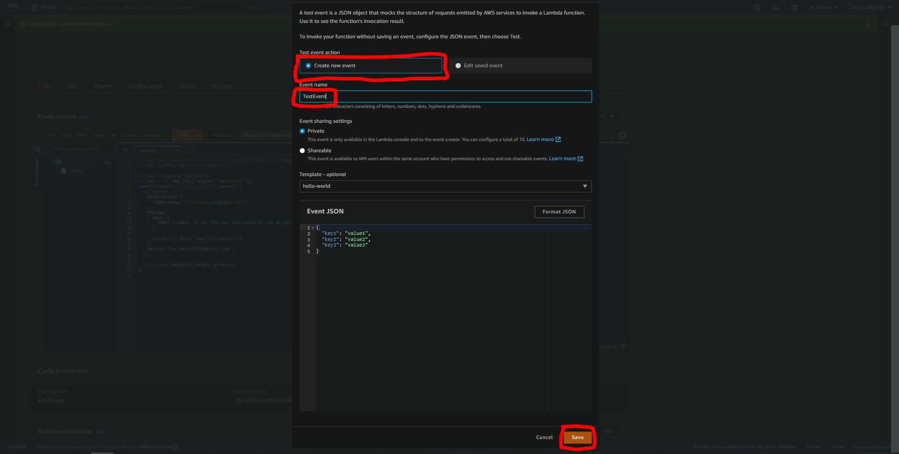

8. Click <span style="color:red">Test</span>. After about 30 seconds the results will show. Look for green `Succeeded` or red `Failure`.

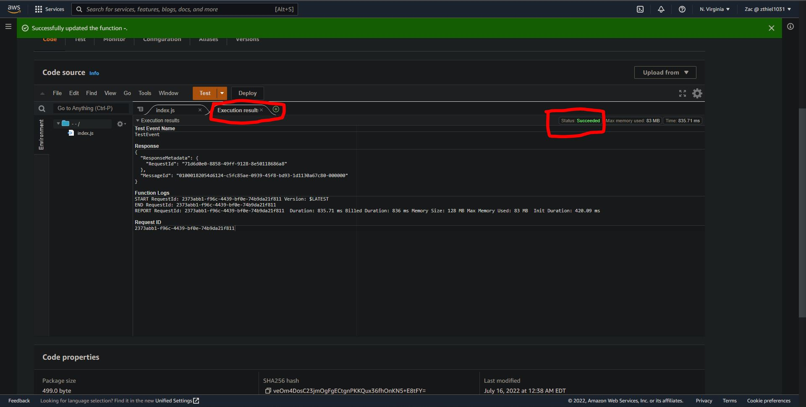


# Create S3 Bucket

To create an S3 Bucket follow these steps:

1. Navigate to <span style="color:red">S3</span> in the management console.


2. On the left-hand pane click on <span style="color:red">Buckets</span> then click <span style="color:red">Create bucket</span>.

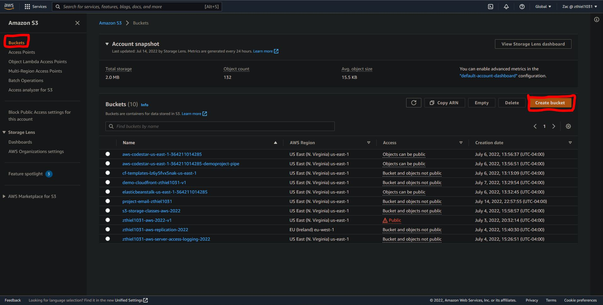

3. Give the bucket a unique name. <span style="color:yellow">testbucketdemo123456789</span> will be used in this example

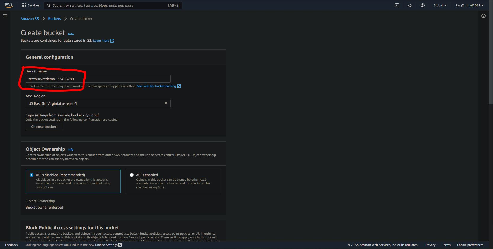

4. Make sure to `Block alll public access`, `Enable Bucket Versioning`, create `tags` and click<span style="color:red">Create bucket</span>.
 

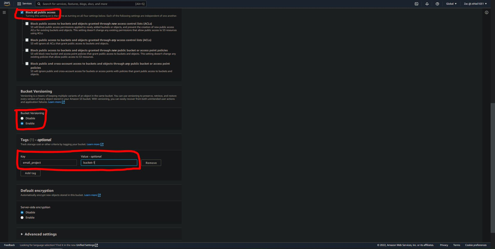
 
# Add trigger and test

1. Navigate to <span style="color:red">Lambda</span> in the management console.


2. On the left-hand pane click on <span style="color:red">Functions</span> then click the newly created function <span style="color:red">email_ses</span>.


3. Click on <span style="color:red">+ Add trigger</span>.

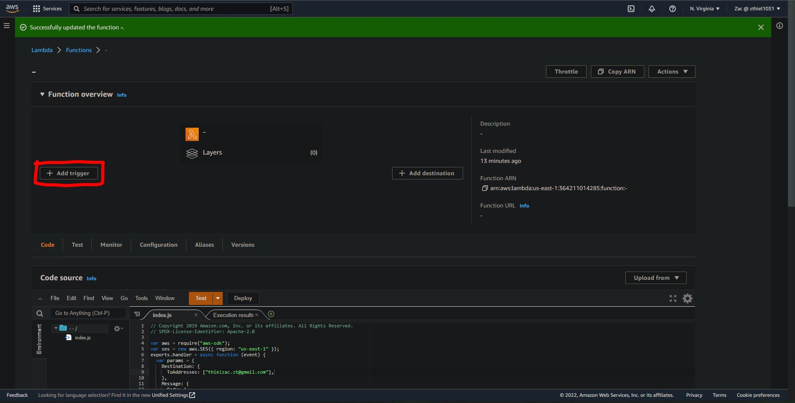

4. Select `S3` as trigger type. Fill in the bucket name that was created. <span style="color:yellow">testbucketdemo123456789</span> was used in this example. And change `Event type` to <span style="color:red">PUT</span>. This will ensure that every time a new file is added, the `Lambda` function gets triggered. Then click <span style="color:red">Add</span>.

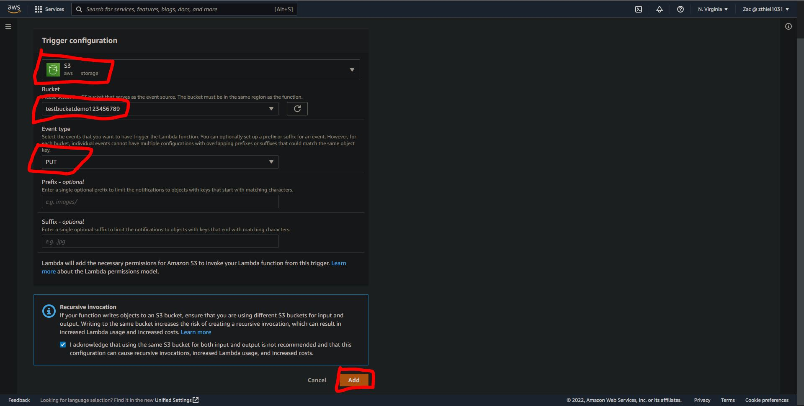

Here is the new function overview:

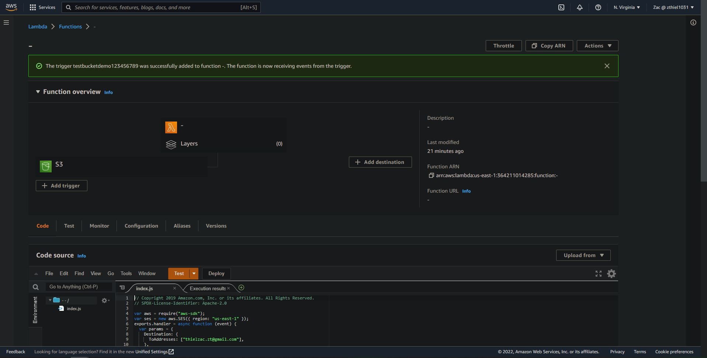

Now to test the function

5. Navigate to <span style="color:red">S3</span> in the management console.


6. On the left-hand pane click on <span style="color:red">Buckets</span> then click <span style="color:red">testdemobucket123456789</span>.

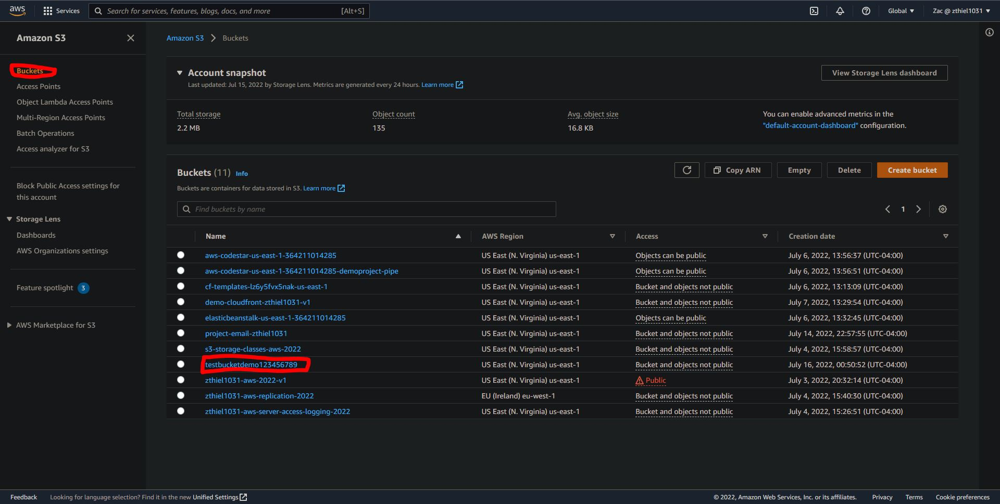

7. Click <span style="color:red">Upload</span>.

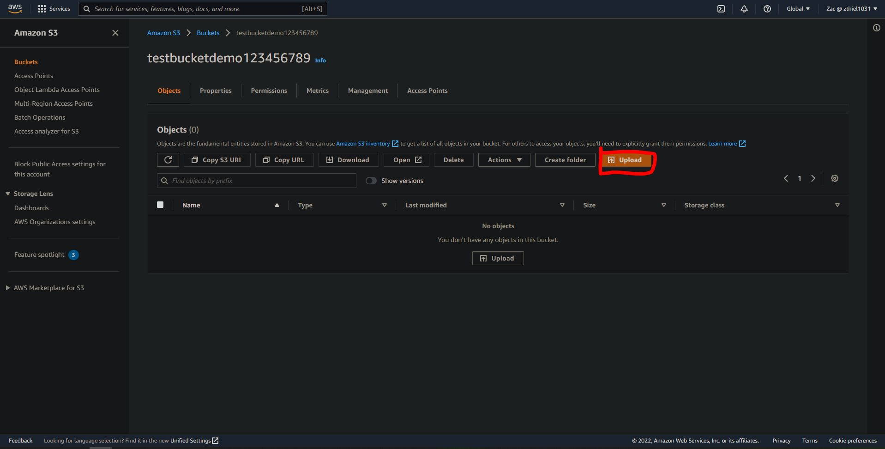

8. Click <span style="color:red">Add files</span> and select a file to upload.

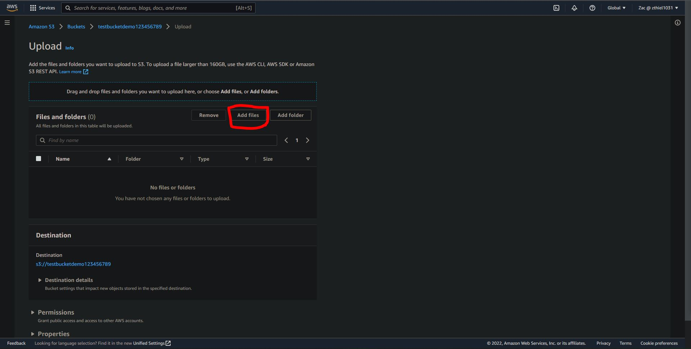

9. Once the green status bar is shown. check the email listed under `ToAddresses`.

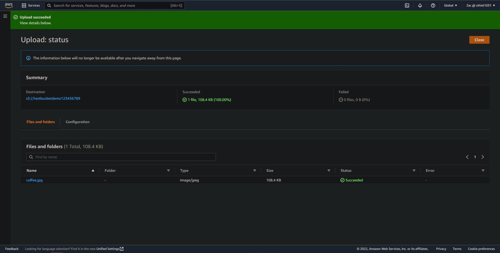

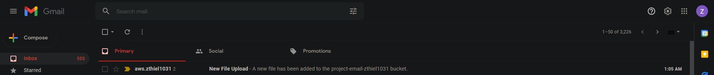