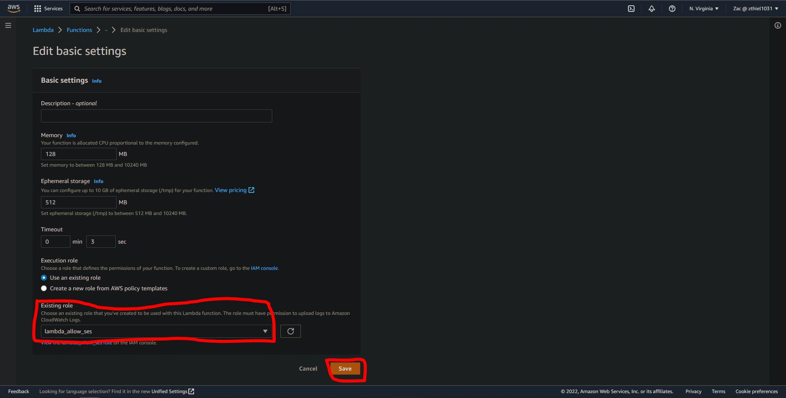

# Emailing using AWS Lambda for S3 bucket uploads

This will serve as a walkthrough for using AWS Lambda in conjunction with SES to email an employee everytime a file is uploaded to a specific S3 bucket. 

As you progress through the walkthrough please note that any  `#ff0000` will be the clickable options in the management console and any ![#ffff00]yellow highlighted text) `#ffff00` will be the fill in variables.


## Steps to deploying lambda function

- set IAM policy and execution role
- verify email identity
- create lambda function for sending email through SES 
- create S3 bucket
- add trigger


# IAM policy and Execution role

In order to access and use the SES service we must first create a  `#ff0000` and a  `#ff0000`.

To create a `policy` follow these steps:


1. Navigate to  `#ff0000` in the management console.


2. On the left-hand side, click  `#ff0000` then  `#ff0000`


3. After clicking on create policy, select the  `#ff0000` tab. Delete everything in the box and enter this code:

```json
{
    "Version": "2012-10-17",
    "Statement": [
        {
            "Effect": "Allow",
            "Action": [
                "ses:SendEmail",
                "ses:SendRawEmail"
            ],
            "Resource": "*"
        }
    ]
}
```

4. Next click on  `#ff0000`
    You can elect to continue without tagging however, it is not recommended, as tags help keep things organized.


5. After applying the appropriate tags for the `Key` we will use ![#ffff00]email_project) `#ffff00` and the `Value` we will use ![#ffff00]ses_lambda_allow) `#ffff00`.

6. Click on  `#ff0000` to continue to the final step in the policy creation.


7. Finally we can give our `policy` a `name` in this case we will use ![#ffff00]Lambda_SES) `#ffff00` and a meaningful `description` then click on  `#ff0000`.


---

Next we will create a `Role` to give `Lambda` permission to access the `SES` service through our `policy`.

To create a `Role` follow these steps:

1. Navigate to  `#ff0000` in the management console.


2. On the left-hand side, click  `#ff0000` then  `#ff0000`


3. Since we are using `Lambda` with `SES` we can set `Trusted entity type` as ![#ffff00]AWS service) `#ffff00` if not already selected. We can set our use case as ![#ffff00]Lamda) `#ffff00` and click  `#ff0000`


4. Next select our policy that was created in the `Policy` section. Under `Permissions policies` select our ![#ffff00]Lamda_SES) `#ffff00` policy and click  `#ff0000`.


5. Now give a name to `Role`. In this exmaple the name ![#ffff00]lambda_allow_ses) `#ffff00` will be used. Then fill in tags `Key` is ![#ffff00]email_project) `#ffff00` and `Value` is ![#ffff00]lambda_iam) `#ffff00`. Click  `#ff0000` after finishing.


# Verify Email Identity

In order to use the `SES` service, the email sender and recipient address identities must be created and verified.

To do so follow these steps:

1. Navigate to  `#ff0000` in the management console.


2. In the left-hand pane click  `#ff0000` then click  `#ff0000`


3. For `Identity type` select ![#ffff00]Email address) `#ffff00`. In the box below, enter the email address to send or recieve the email, ![#ffff00]aws.zthiel1031@gmail.com) `#ffff00` will be used for this example.

4. Tags again are optional, but for consistency and organization sake, tag the `Key` as ![#ffff00]email_project) `#ffff00` and the `Value` as ![#ffff00]email-1) `#ffff00`. Then click  `#ff0000`.


## Repeat steps 2-4 for a second identity
### In our case ![#ffff00]aws.test.zthiel1031@gmail) `#ffff00` was used as the second identity. 

5. After creating the `Identities` navigate to your email inbox and look for an email from `Amazon Web Services` inside click on the  `#ff0000` to authorize this email to be used with `SES`


After doing this screen will be shown to confirm email authorization.


# Create Lambda function and test

Now lets move on to create our `Lambda` function.

To do so follow these steps:

1. Navigate to  `#ff0000` in the management console.


2. On the left-hand pane click on  `#ff0000` then click  `#ff0000`.


3. Select ![#ffff00]Author from scratch) `#ffff00`, then enter a function name. ![#ffff00]email_ses) `#ffff00` will be used in this example. Leave `Runtime` as ![#ffff00]Node.js 16.x) `#ffff00` and select ![#ffff00]x86_64) `#ffff00` for `Architecture`.
Under `Advanced settings` check the box  `#ff0000` and create tags for this function. ![#ffff00]email_project) `#ffff00` will be the `Key` and ![#ffff00]send_ses_lambda) `#ffff00` will be the `Value`. After all that is done click  `#ff0000`.


4. On the left-hand pane click on  `#ff0000` then click the newly created function  `#ff0000`.


5. Scroll down and click on  `#ff0000` then,  `#ff0000`. Make sure the `Role name` matches the role we created above. If it does not, click on  `#ff0000` and under `Existsing role` at the bottom, select the role from the drop-down.




6. Click on  `#ff0000`. Replace the pre-existing code with this:

```json
// Copyright 2019 Amazon.com, Inc. or its affiliates. All Rights Reserved.
// SPDX-License-Identifier: Apache-2.0

var aws = require("aws-sdk");
var ses = new aws.SES({ region: "us-east-1" });
exports.handler = async function (event) {
  var params = {
    Destination: {
      ToAddresses: ["aws.test.zthiel1031@gmail.com"],
    },
    Message: {
      Body: {
        Text: { Data: "A new file has been added to the project-email-zthiel1031 bucket." },
      },

      Subject: { Data: "New File Upload" },
    },
    Source: "aws.zthiel1031@gmail.com",
  };
 
  return ses.sendEmail(params).promise()
};

```

# Please note!
### the `ToAddresses` and `Source` need to be changed to one of your verified identities.


7. After the code is entered click  `#ff0000`, then  `#ff0000`. A `Configure test event` window will pop up. Set `Test event action` to ![#ffff00]Create new event) `#ffff00` and give the event a name. ![#ffff00]TestEvent) `#ffff00` will be used for the example. Leave everything as it is and click  `#ff0000`


8. Click  `#ff0000`. After about 30 seconds the results will show. Look for green `Succeeded` or red `Failure`.


# Create S3 Bucket

To create an S3 Bucket follow these steps:

1. Navigate to  `#ff0000` in the management console.


2. On the left-hand pane click on  `#ff0000` then click  `#ff0000`.


3. Give the bucket a unique name. ![#ffff00]testbucketdemo123456789) `#ffff00` will be used in this example


4. Make sure to `Block alll public access`, `Enable Bucket Versioning`, create `tags` and click `#ff0000`.
 


 
# Add trigger and test

1. Navigate to  `#ff0000` in the management console.


2. On the left-hand pane click on  `#ff0000` then click the newly created function  `#ff0000`.


3. Click on  `#ff0000`.


4. Select `S3` as trigger type. Fill in the bucket name that was created. ![#ffff00]testbucketdemo123456789) `#ffff00` was used in this example. And change `Event type` to  `#ff0000`. This will ensure that every time a new file is added, the `Lambda` function gets triggered. Then click  `#ff0000`.


Here is the new function overview:


Now to test the function

5. Navigate to  `#ff0000` in the management console.


6. On the left-hand pane click on  `#ff0000` then click  `#ffff00`.


7. Click  `#ff0000`.


8. Click  `#ff0000` and select a file to upload.


9. Once the green status bar is shown. check the email listed under `ToAddresses`.


